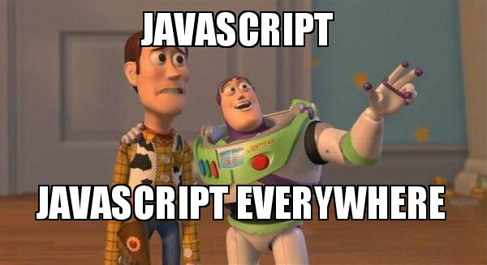

  <b>Title:</b> Reflecting on the Role of AI in Enhancing Software Engineering Education: Insights from ICS 314
  

    <b>I. Introduction</b>
    
In the evolving landscape of software engineering education, Artificial Intelligence (AI) plays a pivotal role. Tools like ChatGPT, Bard, and Co-Pilot have become integral in this journey. My thesis posits that while AI is helpful, it should not become a crutch but rather a complementary tool in the learning process.

  

  

    <b>II. Personal Experience with AI</b>
    
<b>1.</b> Experience WODs (e.g., E18): My experience with GPT, particularly for syntax errors in underscore, has been beneficial. It often reaffirms what I already suspect, offering alternative solutions that, while not always perfect, provide a valuable starting point.

    
<b>2.</b> In-class Practice WODs: The AI's ability to sequentially understand and guide through replicating a site was impressive, showcasing its potential in structured learning environments.

    
<b>3.</b> In-class WODs: The AI's effectiveness in in-class WODs seemed more hit-or-miss, reflecting its limitations in adapting to dynamic classroom scenarios.

    
<b>4.</b> Essays: AI proved useful in enhancing essays, providing additional perspectives and aiding in elaboration, which is particularly helpful in meeting word counts.

    
<b>5.</b> Final Project: For the final project, AI was primarily employed for debugging and resolving ESLint errors.

    
<b>6.</b> Learning a Concept / Tutorial: While I haven't used AI for this purpose, preferring provided videos, AI’s potential for on-the-spot teaching is acknowledged.

    
<b>7.</b> Answering a Question in Class or in Discord: [Not applicable as I haven't engaged in this activity.]

    
<b>8.</b> Asking or Answering a Smart-Question: [Not applicable as I haven't engaged in this activity.]

    
<b>9.</b> Coding Example: 
    <code>// Import the Underscore library 
    const _ = require('underscore'); 
     
    // Example array of objects 
    const people = [ 
      { name: 'Alice', age: 30 }, 
      { name: 'Bob', age: 24 }, 
      { name: 'Carol', age: 29 } 
    ]; 
     
    // Using _.pluck to extract all names 
    const names = _.pluck(people, 'name'); 
     
    console.log(names); // Output: ['Alice', 'Bob', 'Carol']</code>

    
<b>10.</b> Explaining Code: AI's explanations were generally straightforward and accessible, aiding in comprehension.

    
<b>11.</b> Writing Code: AI can write code very well and it knows it works in the way it intends for you.

    
<b>12.</b> Documenting Code: [AI writes comments that are clear and concise.]

    
<b>13.</b> Quality Assurance: AI was a reliable resource for troubleshooting and debugging, often prompting a re-evaluation of my code.

    
<b>14.</b> Other Uses in ICS 314: AI was helpful in brainstorming and listing ideas when needed.

  

    <b>III. Impact on Learning and Understanding</b>
    
AI tools have positively influenced my comprehension, problem-solving, and skill development in software engineering. They provide easy-to-understand explanations, enhancing understanding, albeit with a caveat of overreliance.

  

  

    <b>IV. Practical Applications</b>
    
AI has proven its utility in my job in the HIARNG intelligence field, particularly for terrain and weather analysis, offering information that is not readily available. However, its effectiveness in larger, real-world software engineering projects might be more limited, serving better in resolving minor errors and bugs.

  

  

    <b>V. Challenges and Opportunities</b>
    
The primary challenge with AI is its potential to mislead, especially when the solutions provided are incorrect. However, it holds the potential to be a useful fallback tool for minor tasks and reminders.

  

  

    <b>VI. Comparative Analysis</b>
    
When compared to traditional teaching methods, AI can offer more simplified explanations, like breaking down a math equation. It keeps students engaged, though the onus of knowledge retention and skill development still heavily rests on the student’s active involvement.

  

  

