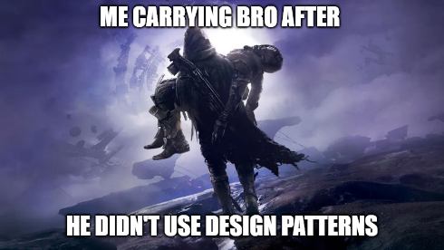

<b>Design Patterns: The Game Mechanics of Software Development</b>

Exploring the realm of software development through the lens of a video game like Destiny 2 offers a captivating analogy for understanding design patterns. In Destiny 2, players navigate an expansive universe, encountering various challenges and employing specific strategies or 'game mechanics' to overcome them. Similarly, in software development, design patterns are the 'game mechanics' that developers use to address coding challenges and enhance the functionality and performance of their applications.

<b>Leveling Up Code with Design Patterns</b>

Take the Singleton pattern, for instance. It's comparable to a unique, powerful weapon in Destiny 2, like an exotic weapon that is so powerful only one can be held at a time in your loadout. This pattern ensures that a class has only one instance across the entire application, much like how a game might restrict a potent item to a single player to maintain balance. In a possible project, I would call it 'CodeQuest,' employing the Singleton pattern, which would be crucial for managing a central configuration system. It would be the 'exotic weapon' of the code, offering a unique and efficient solution that was pivotal to the application's performance.

On the other hand, the Observer pattern mirrors the dynamic and responsive environment of a game like Destiny 2, where actions in one part of the game world can trigger reactions elsewhere. Just as in-game events can cause changes in the game environment or player abilities, the Observer pattern enables objects in a software application to automatically update their state in response to changes in other objects. If I were to do a project where I implemented a live dashboard, this pattern would be instrumental in ensuring that updates in data were immediately reflected across various components, akin to how a player's actions in one part of the game can have cascading effects throughout the game world.

<b>Questing Through Code</b>

In the software development journey, akin to progressing through a game like Destiny 2, design patterns provide the strategic framework or 'gameplay strategies' necessary for tackling complex problems. They are the power-ups, special abilities, and tactical maneuvers that guide developers through the intricacies of coding. Each pattern offers a different 'gameplay style,' catering to various scenarios and challenges and empowering developers to craft code that is not just functional but also efficient and elegant.

<b>Mastering the Game of Code</b>

As I continue my adventure in the vast and intricate world of software development, I look forward to unlocking new 'levels' and 'abilities' by discovering and applying more design patterns. Much like a player in Destiny 2, who masters different aspects of the game to become more proficient, I aim to master various design patterns to enhance my coding skills. In the end, the art of software development, much like the art of gaming, is about strategizing, adapting, and employing the proper 'game mechanics' – and design patterns are the key to winning this game.

  

