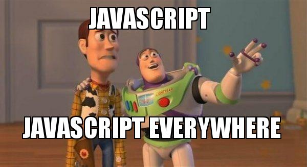

  In 3 paragraphs, I'd like to talk about my interest in Software Engineering and what skills and experience I hope to have. My interest in software engineering stems from an early fondness for games. I did want to be a game designer initially, but I decided against that as I went for a more basic route into general software engineering. I grew up playing games mostly on console but ended up on PC around my first year of high school. At the time, I hadn't thought about doing any ICS-type classes that were offered. My plans still needed to be official. As I continued using a computer daily, I got more accustomed to it, and towards the end of my high school time, I was deciding my major for when I got out of basic combat training and AIT in the military. I looked at the vast amount of majors, and what became most interesting to me was Computer Science. 

Computer Science then sounded great, and I had experience building computers then, so it told me what was within my field of interest. As I continue learning the various languages, I hope to develop the skills to utilize them where they need to be implemented. An easy skill to say I hope to have is, in short, knowing languages. But going more profound than that, I would like to walk away with a more creative mindset and the ability to look at a prompt and come up with more than one way of solving it. 

I hope to develop experiences working with others in a possible natural setting. We will work with each other as the class progresses, and that does offer to make connections as friends with whom we all can get new ideas/help from each other. I also want to feel independent. Independent, as in being able to work on a prompt myself without another's help.

  

