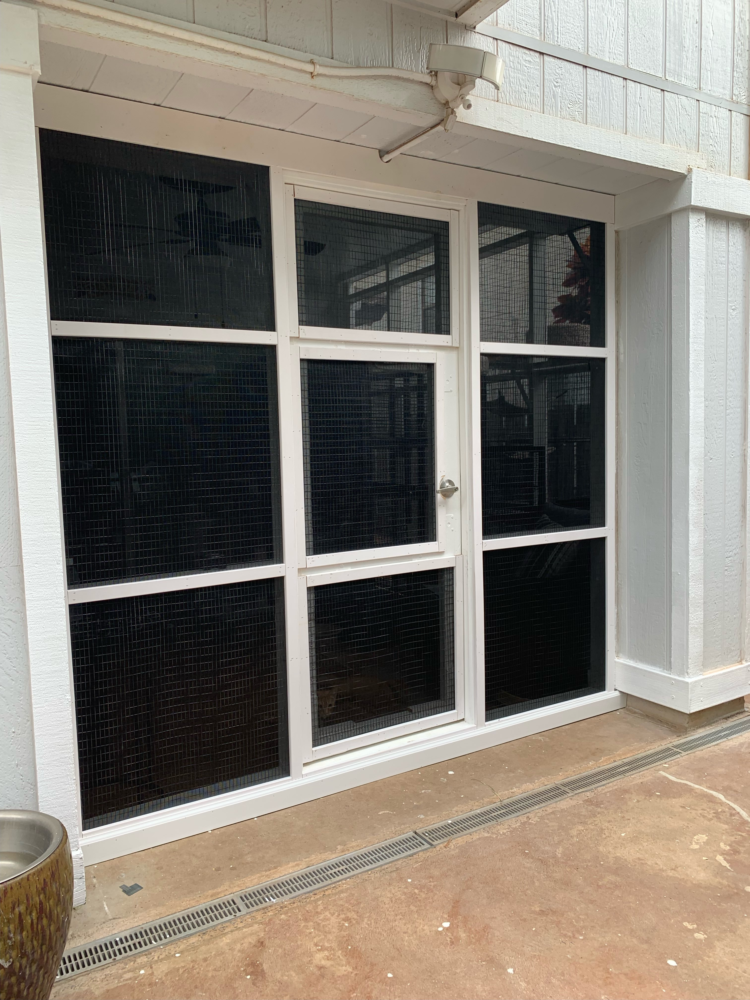
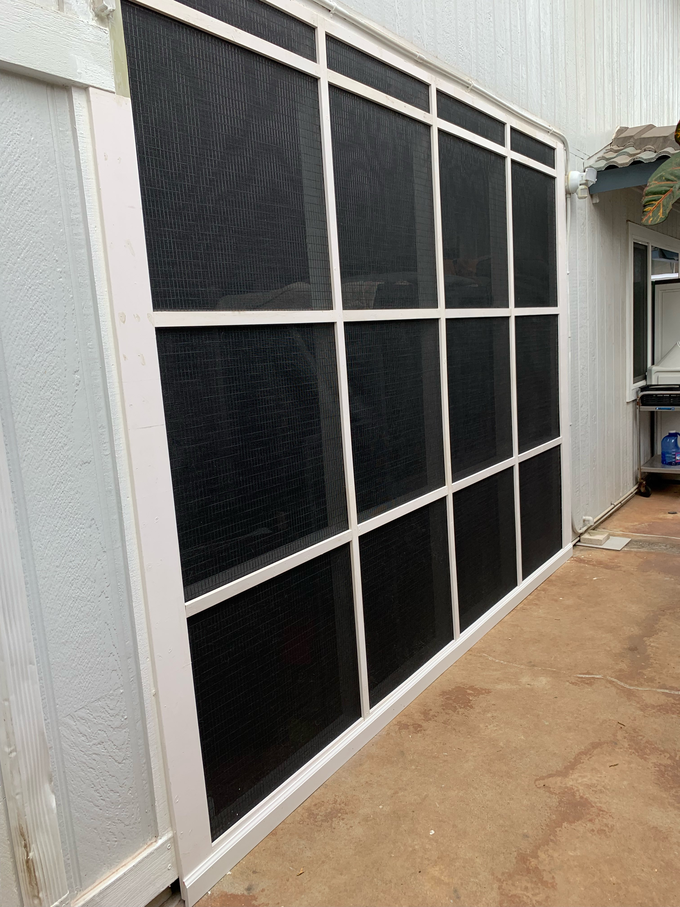
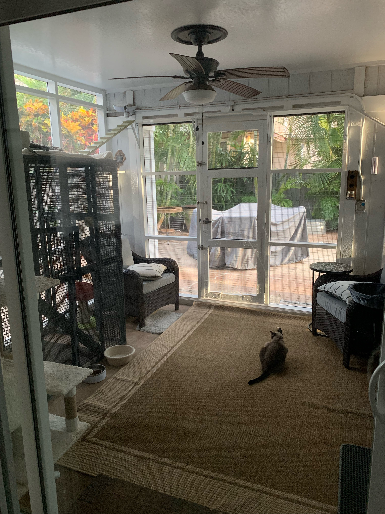

  
  
  

This catio uses painted wood that walls off from the ground to the ceiling outside. Walls were made with a wood frame and overlayed with black mesh reinforced with metal wire on the inside, acting as a second layer. Previously, this area was open, with two pillars supporting the second floor. My family's cats used to always stay in our garage. We would always have to put them in a cage with three levels that rolled around. Having six cats by the time I made the outdoor area the cage and the tedious effort needed to grab all six cats and place them in the cage became a situation that could change with some innovation like a new invention or idea. Orange Tabby is my cat, Hestia. I learned from this project basic carpentry skills and gained some proficiency with the tools used and implementing precision and accuracy.
