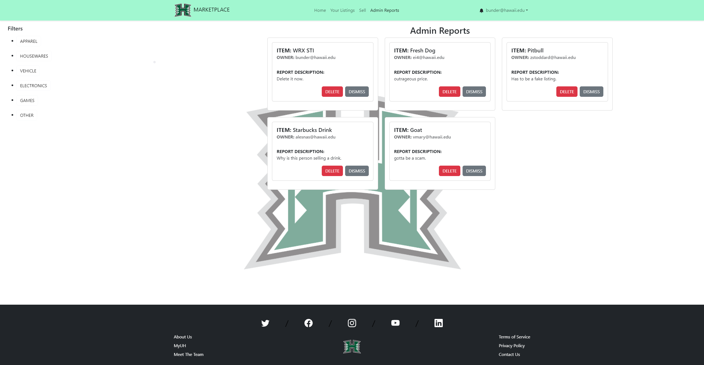
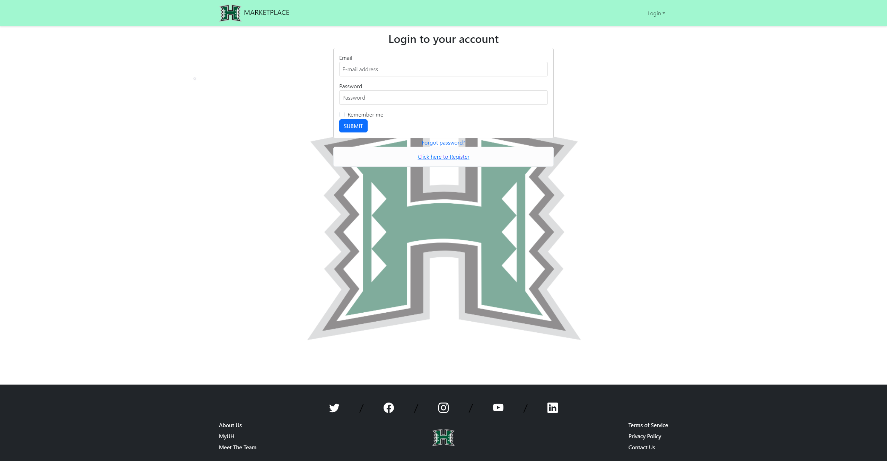

<b>Introduction to UH Marketplace</b>

The UH Marketplace is an innovative online platform designed and developed through the collaborative efforts of our team, leveraging the skills honed in our ICS 314 class and the principles of agile project management. The core aim of UH Marketplace is to provide a virtual space where students can conveniently buy and sell items within the University of Hawaii community. This project serves as a practical application of our coursework, embodying the spirit of entrepreneurship among students.

  

<b>Project Workflow and Contribution</b>

In crafting the UH Marketplace, we meticulously structured our workflow and task distribution by employing GitHub project boards to enhance transparency and facilitate collaboration. Our team, comprising diligent members, ensured that responsibilities were evenly shared, fostering an environment of collective effort and mutual support.

<b>Key Features and Personal Involvement</b>

My direct contributions to the UH Marketplace were multifaceted. I developed the robust 'Admin Reports' page, which allows for effective management of listings, including features such as the removal and reporting of inappropriate or fraudulent items. This page is instrumental in maintaining the integrity and trustworthiness of the marketplace.

  

Furthermore, I enhanced user interaction by refining the 'Login' page, ensuring a seamless and secure user experience. This page is the gateway for users to access their personalized marketplace experience, manage their listings, and engage with the community.

  

<b>Reflecting on the Learning Experience</b>

The hands-on experience of developing the UH Marketplace was enriching on multiple levels. It honed my technical prowess in web development and deepened my appreciation for the meticulous planning and execution that goes into creating a user-centered digital platform. Beyond the coding skills, this project refined my abilities in leadership, initiative, and communication, underlining the multifaceted nature of software engineering. It was a tangible application of theoretical knowledge, embodying the convergence of technology and community service.

<b>Conclusion</b>

In conclusion, the UH Marketplace is more than just a project; it's a testament to the power of collaborative learning and the practical application of academic knowledge in solving real-world problems. It reflects our commitment to enhancing the student experience through technology, and I am proud to have contributed to this endeavor.

Organization and Source Code: <a href="https://github.com/the-manoa-marketplace">UH Marketplace</a>

